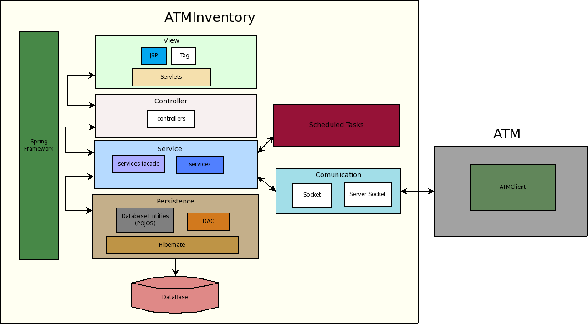

************
Architecture
************

ATM Inventory is structured in several layers based on the usual Spring model for web applications. Each layer has an interface which should be accesed only by the immediately superior layer (with the exception of the POJOs):
   * **View**: holds the GUI components and its related JavaScript.
   * **Controller**: is in charge of retrieving the information needed by every requested page and sending it to the jsp. It can also do some simple operations related to GUI components and the user's locale (e.g. date formats).
   * **Service**: they contain the business logic of the application.
   * **Persistence**: the layer in charge of requesting the database operations to Hibernate. It contains the DAOs (Data Access Objects) and POJO's (Plain Old Java Objects), responsible of the Hibernate calls and storing each entity's data respectively.
   * **Scheduled task**: Holds all the tasks that run in parallel

All the five layers use several components of the *Spring Framework*, and the persistence layer uses *Hibernate* as well.

There is a sixth layer, parallel to the Service one, in charge of the communication with the remote ATMAgents. This layer communicates only with the Service and the remote ATMAgents and viceversa.

In the following sections we include the architectural UML diagrams of ATM Inventory. Each section explains the system from a different point of view based in the 4+1 model.
