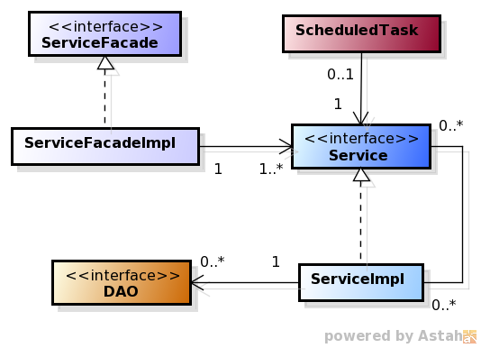
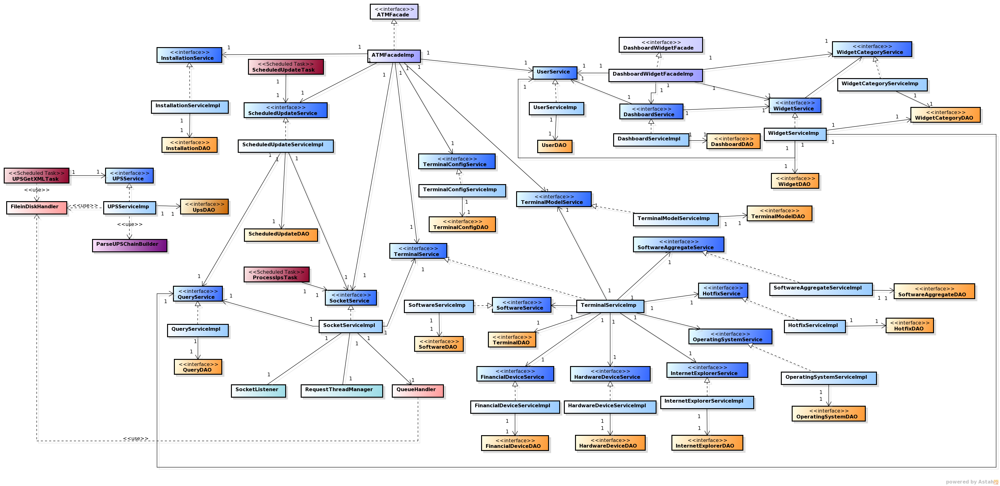
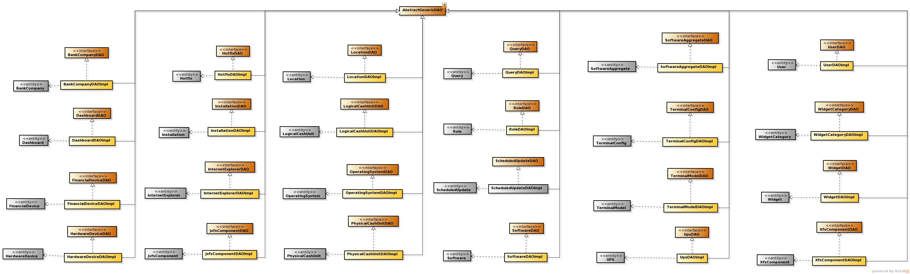

**************
Class Diagrams
**************

The Class Diagrams presented in this section are simplified versions which not include the attributes or methods, focusing on the visualization of
the class relationships. 

Controller Class Diagram
========================

.. image:: diagrams/controllerHl.png
    :align: center

Each Controller holds the responsibility of communicating between the view (jsp pages) and the Service Layer. From that layer it obtains the
model object and performs operations onto those entities. The Controller can create new model objects and insert their data, but **cannot save
their state**, which is responsibility of the Persistence layer (through the Service layer). All the controllers inherit from *GenericController* who is the one that holds commons methods to all the controllers, in this case the heritance is being use in the sake of code reuse and not to being able to replace the classes using the father

Controllers may also instantiate helper classes for performing specific tasks (e.g. property editor in charge of parsing date strings to Date
objects).

The access to the service layer can be made through two kind of service class, the Facade service class or the atomic service class, and is possible to call both of them inside a controller because not all the business operations reside in a facade, sometimes will be needed to use an atomic one.

Detailed Class Diagram
----------------------
Below is the detailed class diagram, where it is possible to see all the relationships between the controllers, the services and the entities.

.. note:: the relations between the entities, DAO and the services have been omitted on purpose in this diagram, because the main objective is to show
	the main relationships of each controller. For knowing the precise relationship between the services and the DAO, and the DAO with the entities, check the diagrams in the
	sections `Service Detailed Class Diagram`_, `DAO Detailed Class Diagram`_ and for all the relationships between the entities, check the section `Entities Class Diagram`_ .

The LoginController and the HelpController hold primarily redirection logic, as the login functionality is completely provided by Spring and
the help pages are just static HTML.

Service and Persistence Class Diagram
=====================================

.. note::The relationship between the DAOs and the entities was omitted in this diagram in order to simplify it. If you want to check those
	relationships, please refer to the section `Dao Detailed Class Diagram`_.

In the service layer reside two kind of services, one that offers atomic operations and act more like an interface from the DAO layer where basically each Service has a 1-1 relationship with a DAO , although there are some cases where an Atomic Service has some auxiliar DAOs,  The Atomic Services are the only allowed to access to the DAO layer using a direct relationship .

The other kind of services are an implementation of a Facade Design pattern, where an Facade hides the complexity of the service layer to a client. In this case a Facade can have relationship with several Atomic Services and offer a simplified interface. The Facade are not allowed to call the DAO layer directly, it must be done through an Atomic Service.

All the services are defined by an interface with a sole implementation, and each client of the service is intended to call or instantiate the service
using the interface and Spring support (this is currently being done with Spring annotations and injection).

The Scheduled Task in order to execute some repetitive operation, such as check for updates or, parse the XML from the UPS, must call a service in order to perform the operation. The responsibility of each  Task Class is bounded to call a service method and prepare the parameters if is needed.

Service Detailed Class Diagram
------------------------------
Below is the complete class diagram where we can see the relationships between Atomic Services and DAOs and Facade Services and Atomic Services:

Sockets Class Diagram
---------------------
The socket classes are in charge of providing the communication between the ATM Agent and the server in both directions. You can check how
those classes are related in the next diagram:

.. image:: diagrams/sockets.png
    :width: 800px
    :align: center
    :height: 500px

In order to know to which ATM the server is going to establish a communication, must extract the IP from a queue that holds all the ATM’s IP, this queue resides in disk and is managed by the class *QueueHandler* . That class holds all the methods needed to operate over the queue.

The *SocketService* acts as an interface to all the thread classes and hides the existence of this class, this means that when a thread needs to extract an ip must call the Service.

UPS XML Parser Class Diagram
----------------------------
Below is the complete class diagram where it is possible to see the classes involved in the UPS XML Parsing process

The process of parsing an XML is based on a modified Chain of Responsibility Pattern, where each link does not know that belong to a chain and the construction of the chain is made through a class named *ParseUPSChainBuilder* and each link is added dynamically  using reflexion. In order to know which class is a parser, the chain builder uses the annotation *UPSParser*.

Also the class *ParseUPSChainBuilder* hides to the other classes the existence of a responsibility chain or multiple parsers because is acting as a Facade to hide the complexity of the implementation, this way is simpler to add new parsers without the need of modifying code.

The class *ParseUPSXML* is the one that represent an actual link, from this abstract class all the others link inherit the methods needed to execute the chain. 

It Is possible to implement specific parsers that suits better to an XML, in this case exist two classes that holds the basic logic to implement the default XML parsers in java which are DOM and SAX, the concrete class will only have the logic related to parse the XML  and produce the DTO (*UPSInfo*) while the superclass all the generic code.

The Interface *UPSExtraInfo* allows to extend the basic DTO, all the concrete classes that implement this interface can hold more attributes from the XML, this way is possible to add specific code in the service to handle different content without having to add new attributes to the main DTO 

Dao Class Diagram
-----------------
The DAO classes allow to perform CRUD [1]_ and other operations over the entities, following the basic DAO Pattern where a DAO class is
defined using an interface and all the instances should be used through that interface. The relationship between DAO classes and entities (POJOs)
is 1-1, which means that each entity has a related DAO class that provides the required operations onto it. Each DAO class inherits from an
abstract parameterized class (AbstractDAO) all the base CRUD methods:

.. [1] *Create, Read, Update, Delete*

DAO Detailed Class Diagram
%%%%%%%%%%%%%%%%%%%%%%%%%%
The next diagram shows all the DAOs and its related entities:
 

Entities Class Diagram
======================
The entities, or POJOs, are classes that conceptually represent a database table, and each instance of those classes represents a row of the
corresponding table. That's the reason why the relationships between these objects are pretty similar (but **NOT IDENTICAL**) to the ones between the database tables.

The cardinality of the relationships is given by `JPA (Java Persistence API) <http://www.oracle.com/technetwork/java/javaee/tech/persistence-jsp-140049.html>`_ annotations present in the classes (`@ManyToOne <http://docs.oracle.com/javaee/7/api/javax/persistence/ManyToOne.html>`_, `@OneToMany <http://docs.oracle.com/javaee/7/api/javax/persistence/OneToMany.html>`_, `@ManyToMany <http://docs.oracle.com/javaee/7/api/javax/persistence/ManyToMany.html>`_ and `@OneToOne <http://docs.oracle.com/javaee/7/api/javax/persistence/OneToOne.html>`_ ).
 
In the next diagram we include all the classes and their relationships [2]_:

.. image:: diagrams/entity.png
    :width: 1000px
    :align: center
    :height: 600px

.. [2] The diagram does not include the historic component, which means it reflects the valid relationships' cardinalities in a specific moment.
