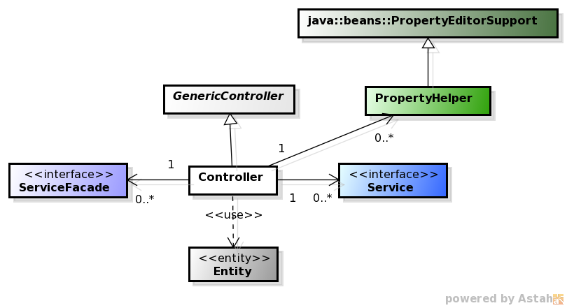
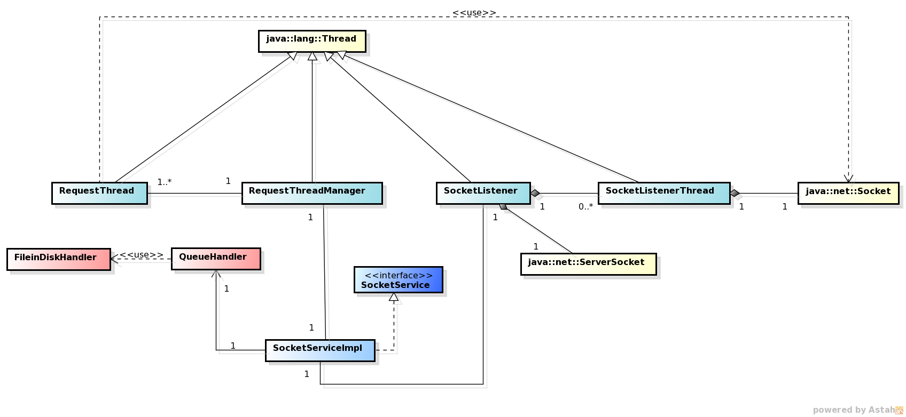

**************
Class Diagrams
**************

The Class Diagrams presented in this section are simplified versions which not include the attributes or methods, focusing on the visualization of
the class relationships. 

Controller Class Diagram
========================

Each Controller holds the responsibility of communicating between the view (jsp pages) and the Service Layer. From that layer it obtains the
model object and performs operations onto those entities. The Controller can create new model objects and insert their data, but **cannot save
their state**, which is responsibility of the Persistence layer (through the Service layer).

Controllers may also instantiate helper classes for performing specific tasks (e.g. property editor in charge of parsing date strings to Date
objects).

Detailed Class Diagram
----------------------
Below is the detailed class diagram, where it is possible to see all the relationships between the controllers, the services and the entities.

.. image:: diagrams/controller.png
    :width: 1000px
    :align: center
    :height: 600px

.. note:: the relations between the entities and the services have been omitted on purpose in this diagram, because the main objective is to show
	the main relationships of each controller. For knowing the precise relationship between the services and the entities, check the diagram in the
	section `Service Detailed Class Diagram`_, and for all the relationships between the entities, check the section `Entities Class Diagram`_ .

The UserService is referenced in each controller, with the exception of the HelpController and LoginController. That Controller is used mainly
for checking whether the user is logged, and if it is, asking this service to return the Entity related so we can obtain the customized welcome
message.

The LoginController and the HelpController hold primarily redirection logic, as the login functionality is completely provided by Spring and
the help pages are just static HTML.

Service and Persistence Class Diagram
=====================================
.. image:: diagrams/serviceHl.png
    :align: center

.. note::The relationship between the DAOs and the entities was omitted in this diagram in order to simplify it. If you want to check those
	relationships, please refer to the section `Dao Detailed Class Diagram`_.

Currently each Service acts as an interface to one DAO, so basically each Service has a 1-1 main relationship with a DAO, although there are some
cases where a Service has some auxiliar DAOs, and also DAOs which are used by several Services. Some Services also hold a relationship with another
Service in order to provide a complex business logic operation related to multiple entities through a simple Service method call.

The services are defined by an interface with a sole implementation, and each client of the service is intended to call or instantiate the service
using the interface and Spring support (this is currently being done with Spring annotations).

Service Detailed Class Diagram
------------------------------
Below is the complete class diagram where we can see the relationships between Services and DAOs:

.. image:: diagrams/service.png
    :width: 1000px
    :align: center
    :height: 600px

Sockets Class Diagram
---------------------
The socket classes are in charge of providing the communication between the ATM Agent and the server in both directions. You can check how
those classes are related in the next diagram:

Dao Class Diagram
-----------------
The DAO classes allow to perform CRUD [1]_ and other operations over the entities, following the basic DAO Pattern where a DAO class is
defined using an interface and all the instances should be used through that interface. The relationship between DAO classes and entities (POJOs)
is 1-1, which means that each entity has a related DAO class that provides the required operations onto it. Each DAO class inherits from an
abstract parameterized class (AbstractDAO) all the base CRUD methods:

.. image:: diagrams/daoHl.png
    :align: center

.. [1] *Create, Read, Update, Delete*

DAO Detailed Class Diagram
%%%%%%%%%%%%%%%%%%%%%%%%%%
The next diagram shows all the DAOs and its related entities:
 
.. image:: diagrams/dao.png
    :width: 1000px
    :align: center
    :height: 600px

Entities Class Diagram
======================
The entities, or POJOs, are classes that conceptually represent a database table, and each instance of those classes represents a row of the
corresponding table. That's the reason why the relationships between these objects are pretty similar (but **NOT IDENTICAL**) to the ones between the database tables.

The cardinality of the relationships is given by JPA annotations present in the classes (`@ManyToOne <http://docs.oracle.com/javaee/7/api/javax/persistence/ManyToOne.html>`_, `@OneToMany <http://docs.oracle.com/javaee/7/api/javax/persistence/OneToMany.html>`_, `@ManyToMany <http://docs.oracle.com/javaee/7/api/javax/persistence/ManyToMany.html>`_ and `@OneToOne <http://docs.oracle.com/javaee/7/api/javax/persistence/OneToOne.html>`_ ).
 
In the next diagram we include all the classes and their relationships [2]_:

.. [2] The diagram does not include the historic component, which means it reflects the valid relationships' cardinalities in a specific moment.

Diagrams Source Files
=====================
These diagrams were made using `Dia 0.96 <http://dia-installer.de/)>`_. You can download their source files here:

* :download:`Controller High Level Class Diagram <uml-diagrams/controllerHl.dia>`

* :download:`Controller Complete Diagram <uml-diagrams/controller.dia>`

* :download:`Services High level Class Diagram <uml-diagrams/serviceHl.dia>`

* :download:`Services Complete Class Diagram <uml-diagrams/service.dia>`

* :download:`Sockets Complete Class Diagram <uml-diagrams/sockets.dia>`

* :download:`Dao High level Class Diagram <uml-diagrams/daoHl.dia>`

* :download:`Dao Complete Class Diagram <uml-diagrams/dao.dia>`

* :download:`Entities Class Diagram <uml-diagrams/entity.dia>`
