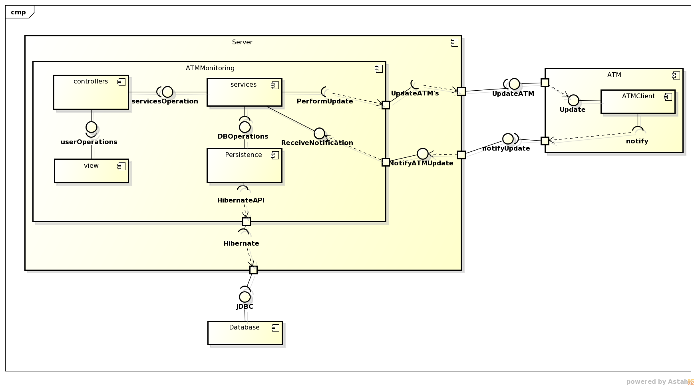

*****************
Component Diagram
*****************
Below we can check the general architecture of the system, which is based on a MVC pattern:

Basically the ATMMonitoring is divided into four components:
	* The *Persistence*, where all the DAO and POJO objects reside.
	* The *Services*, which hold the objects that allow access to the persistence layer via specific and atomic business logic operations.
	* The *Controllers*, in charge of communicating with the view and consuming the services in order to perform operations.
	* The *View*, where all the HTML pages are (actually JSP pages that result in HTML).

ATMMonitoring communicates with two other components: first the *ATMClient*, that is in charge of the ATM update communication; and the *Database*
where the information is stored. 

Diagrams Download
=================

This diagram was made using `Astah Community Edition 6.8.0/d254c5 <http://astah.net/download)>`_:

* :download:`Component Diagram <uml-diagrams/Component_Diagram.asta>`
