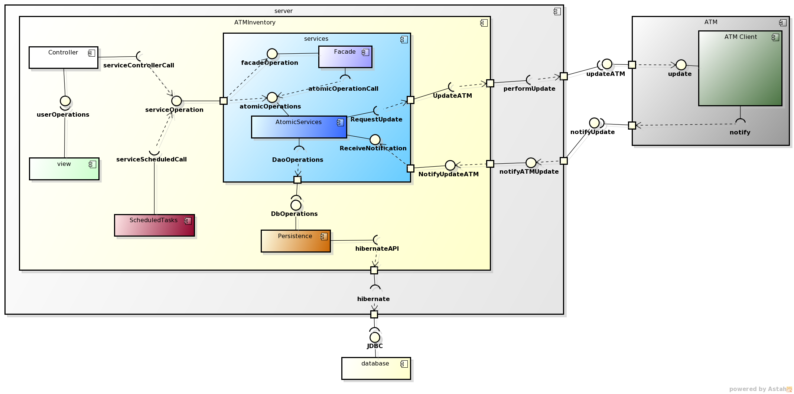

*****************
Component Diagram
*****************
Below we can check the general architecture of the system, which is based on a MVC pattern:

Basically the ATM Inventory is divided into five main components:
	* The *Persistence*, where all the DAO and POJO objects reside.
	* The *Services*, which hold the objects that allow access to the persistence layer via specific and atomic business logic operations.
		* *The Service Facade*: where the facades that hides the complexity of the service layer can be found.
		* *The Atomic Services*: with all the services that performs specific operation resides.
	* The *Controllers*, in charge of communicating with the view and consuming the services in order to perform operations.
	* The *View*, where all the HTML pages are (actually JSP pages that result in HTML).
	* The *Scheduled Task*: in charge of executing recurring tasks.

ATM Inventory communicates with two other components: first the *ATMClient*, that is in charge of the ATM update communication; and the *Database*
where the information is stored. 

