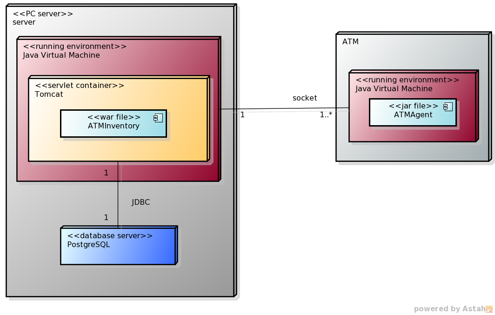

******************
Deployment Diagram
******************

The following deployment diagram explains describes the whole production environment of ATM Inventory:

    
The artifact ATM Inventory is a war file that is deployed inside a Servlet Container, in this case a Tomcat server which runs under a standard Java Virtual Machine.

ATM Inventory communicates with two other nodes: first with the database, this node in the actual configuration is deployed inside the
same one that holds the Tomcat server, but it could be it could be in an external one; the other type of communication is made with the external ATMs
that have the ATM agent installed.

