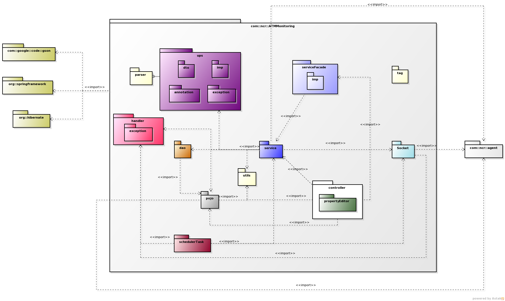

***************
Package Diagram
***************

    
The main package of the system is **com.ncr.ATMMonitoring**, from there we have the following specific packages: 

* **com.ncr.ATMMonitoring.controller**: holds all the controller classes, those in charge of connecting the web pages with the services.
* **com.ncr.ATMMonitoring.service**: contains all the interfaces and implementations for each specific service.
* **com.ncr.ATMMonitoring.socket**: holds the classes in charge of the communication between the ATM agent and the server.
* **com.ncr.ATMMonitoring.dao**: inside we have all the interfaces and implementations of each DAO.
* **com.ncr.ATMMonitoring.pojo**: holds all the entities (POJOs) used by the system.
* **com.ncr.ATMMonitoring.util**: contains the util or helpers classes.
* **com.ncr.ATMMonitoring.tag**: inside we can find the classes that hold the logic required to define a custom JSP tag.

The whole system has dependencies with the following external packages:
   * **com.ncr.agent**: defines all the data classes related to the ATM agent in order to allow the communication with the server.
   *  *Libraries*: this system currently uses some well known frameworks and libraries included in the following external packages:

      * **org.hibernate**: package that has all the `Hibernate <http://hibernate.org/orm/documentation/>`_ classes.
      * **org.springframework**: holds the `Spring Framework <http://spring.io/docs>`_.
      * **com.google.code.gson**: includes `GSON <http://https://code.google.com/p/google-gson/>`_, the library that eases the (de)serialization of Java objects to Json.

.. note:: in this diagram we reflected only the main dependencies. Others, such as log4j, were omitted beacuse they are not actually relevant to the architecture.

Diagrams Download
=================
This diagram was made using `Dia 0.96 <http://dia-installer.de/)>`_:

* :download:`Package Diagram <uml-diagrams/package.dia>`
