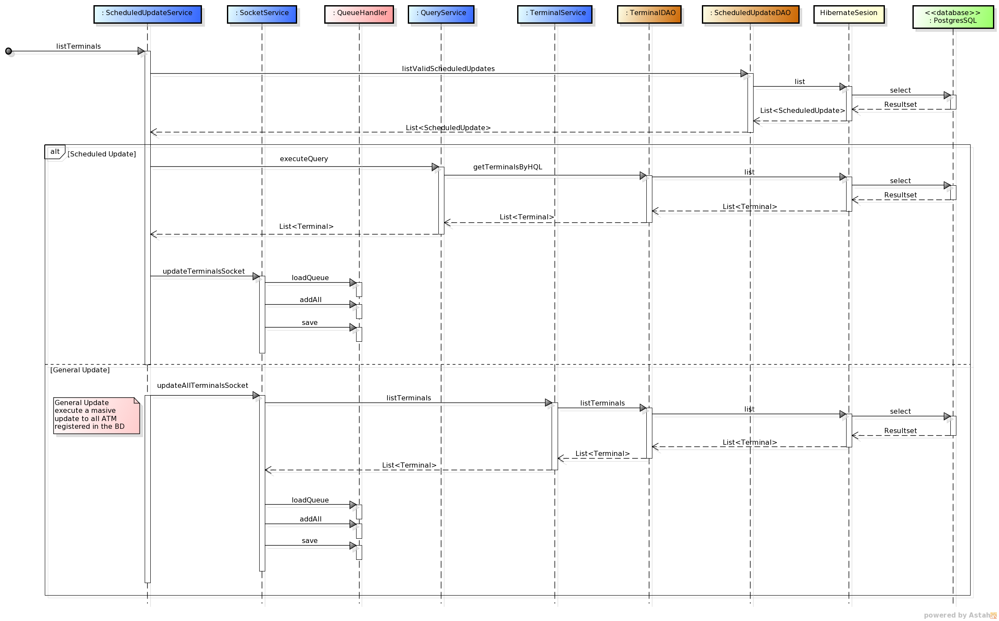
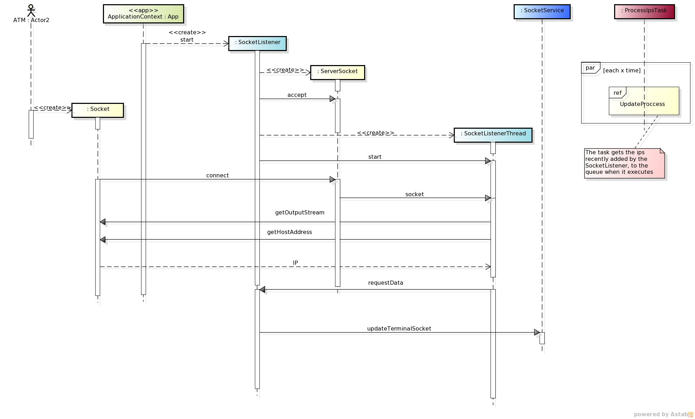

*****************
Sequence Diagrams
*****************
In this section are presented the sequence diagrams that allow to understand how the different calls are made between the objects

General Sequence Diagram
========================

.. image:: diagrams/Sequence_Diagrams/General_Sequence_Diagram.png
      :width: 800px
      :align: center
      :height: 600px
      
The general behavior of ATM Inventory is as shown above: first the user selects an operation from the HTML view, that operation sends
a message to the corresponding controller, and after the message is received, the controller invokes a service facade, who calls an atomic service to operate over the entities.
When the atomic service receives the message, it will call the corresponding DAO operation. Finally, the DAO will use the Hibernate session to
perform the corresponding database operation(s).

After the operation has ended in the database, Hibernate will generate the object, if the operation was a fetch, or will update the state of
each entity object. Then the result of the operation will be show to the user.

.. note:: It is possible that the controller call directly an atomic service, in that case the sequence is the same as shown above after removing the facade.

Update Request
==============
The update process can be requested by two actors, the user or the ATM itself. The user may as well request an update in two different ways:
first, requesting it using the web page; the other way, by scheduling an update that will run at specific times defined by the user.

User Request
%%%%%%%%%%%%

The user can request a data update by simply clicking onto the **Update** button in the Terminal's data page. The sequence diagram of the process
is included next:

      
First the user calls the controller by pressing the update button, that calls the method *updateTerminal* in the *TerminalController* who calls
the *ATMFacade* to initiate the update process. The *SocketService*, who was called by the *ATMFacade*, asks *TerminalService* for all the terminals that can be updated, when
the list is received, it calls the method in charge of adding the ips to the queue. in parallel the `Update Process`_ is being executed periodically by *ProcessIpTaks*, who will see the new ip added to the queue by the user and executes the update.

Scheduled Request
+++++++++++++++++

The scheduled updates are made using the web interface where we can plan an update based on a saved query that returns all the ATMs we want to
be updated on a weekly or monthly basis. The following is the sequence diagram of that process:

      
To add a new scheduled update, first we retrieve all the queries saved by the user: the *ScheduledController* calls the *UserService*.

When the user fills all the required fields on the HTML interface and submits the form, that information is received by the
*ScheduledController* by calling the addScheduledUpdate. That method will invoke the *ATMFacade* delegating to *ScheduledService* the call to the corresponding DAO
in order to save the new scheduled update.

In  different threads, two processes will be running in order to check if any scheduled update must be executed and to execute the actual update. The first process starts
in the *ScheduledUpdateTask*, who calls the  *ScheduledUpdateService*  in order to asks the *ScheduledDAO* for all scheduled updates that must be executed that minute. After retrieving them, it will obtain the *Terminals* returned by the related *Query*, and then, will add to the queue all the IP found. When the `Update Process`_ , running in a parallel thread  executes, will take the recently added ip to perform the update.

ATM Request
%%%%%%%%%%%

The ATMs can also request data updates to the ATM Inventory on their own. For achieving this, our server application is listening to any possible
request from the ATM's through a socket connection (same technology used in the ATMs' agent connections).
Next you can see the sequence diagram of this process:

   
The first step of this process is done by the application context, in other words, the Spring Framework. When the application
starts for the first time, it creates a new Thread (*SocketListener*) That will start the `SocketServer <http://docs.oracle.com/javase/7/docs/api/java/net/ServerSocket.html>`_ who will listen to a specific port waiting for any data update requested from an ATM. 

When a new request arrives ( an open `Socket <http://docs.oracle.com/javase/7/docs/api/index.html?java/net/Socket.html>`_  from the ATM)
the *SocketListenerThread*  will be in charge of extracting the message from the remote ATM agent. After the message is
received, the control is returned to the *SocketListener* who will call the *SocketService* in order to add the ip of the ATM to the queue. When the `Update Process`_ , running in a parallel thread  executes, will take the recently added ip to perform the update.   
      
Update Process
%%%%%%%%%%%%%%

This is the process which effectively updates the ATM info in the database. Stats by a cron process that runs only at specific times, requesting the
most recent data from the ATM's agent. The following diagram illustrates how this process flows: 

The *SocketService* has a method called **processAwaitingIps**  that  is called by a method marked as an
`Spring Scheduled process <http://docs.spring.io/spring/docs/3.1.3.RELEASE/javadoc-api/org/springframework/scheduling/annotation/Scheduled.html>`_  in  *ProcessIpsTask*
which means that the method will be run periodically at specific times, just like a `cron process in Linux <http://en.wikipedia.org/wiki/Cron>`_.

When **processAwaitingIps** runs, it read the actual queue then, creates a new *RequestThreadManager*, which will create a new *RequestThread* per each found ip [1]_ to retrieve the information from the ATMs.

The *RequestThread* will obtain the first ip from the queue, and then opens a Socket to communicate with the remote ATM. If the *RequestThread* succesfully receives the information from the ATM,
it will call the method *handleSuccess* in the *RequestThreadManager*. From there the method *processTerminalJson* in the *SocketService* will be
called, which will read the JSON received from the ATM. After the JSON is read, the information obtained will be saved into the Database calling
the method *persistDataStoreTerminal* in the class *TerminalService*.

If the information from the ATM can't be received, the *RequestThread* will call the method *handleError* in the class *RequestThreadManager*. From
there, the method *updateTerminalSocket* in the class *SocketService* will be called and and the ip will be the set again into the queue to try in the next cycle.

.. [1] *With the default configuration, up to a maximum of 50 IPs per thread and 20 threads.*

Query Management
================

Each user of ATM Inventory can create, store and execute Queries that fetch a list of ATMs. These queries can also be used for the scheduled updates.
In the following diagram we detail the query process:

.. image:: diagrams/Sequence_Diagrams/Query_Sequence_Diagram.png
      :width: 800px
      :align: center
      :height: 400px

In order to save a new query or update an existing one, the user must select all the desired fields to query and their conditions to be fulfilled
by the ATMS through the web interface. When the user has set all the parameters, by sending the form the method *saveOrUpdateQuery* in the
*QueryController* is called. An additional parameter telling us whether the operation is an update or save is included in the request.
Depending on the value of that parameter, the method *addQuery* (for saving) or *updateQuery* (for updating) in the *QueryService* will be called
and from there the operation to be executed will be either a save or a update in the database.

For executing the query, the user simply presses the corresponding button in the HTML interface, which will call the same method, *saveOrUpdateQuery*
in the *QueryController*, but with the difference that the value in that additional parameter will be *execute*. The *QueryController* will then call
the method *executeQuery* in the *QueryService*, and that service will call the method *getTerminalsByHQL* in the *TerminalDAO*. That method is in
charge of generating and executing the HQL query with the parameters selected by the user. When the operation is performed, the list of matching ATMs
is shown to the user.
