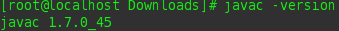
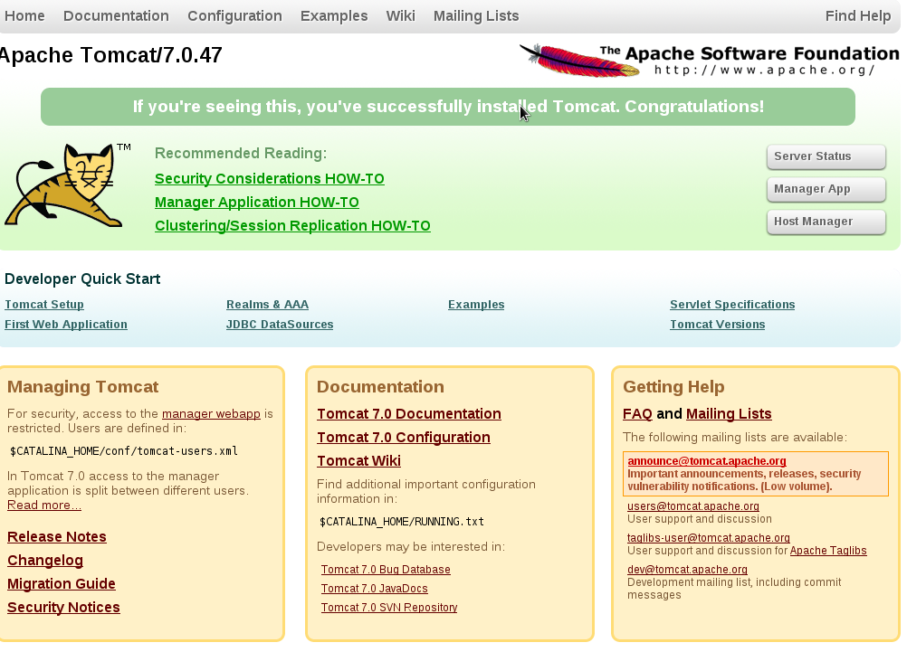
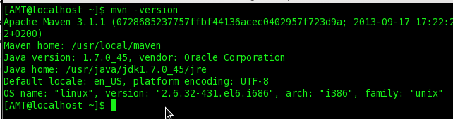
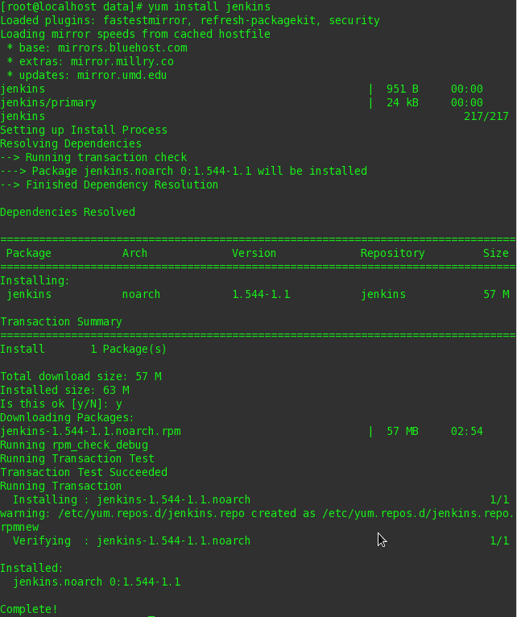
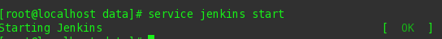
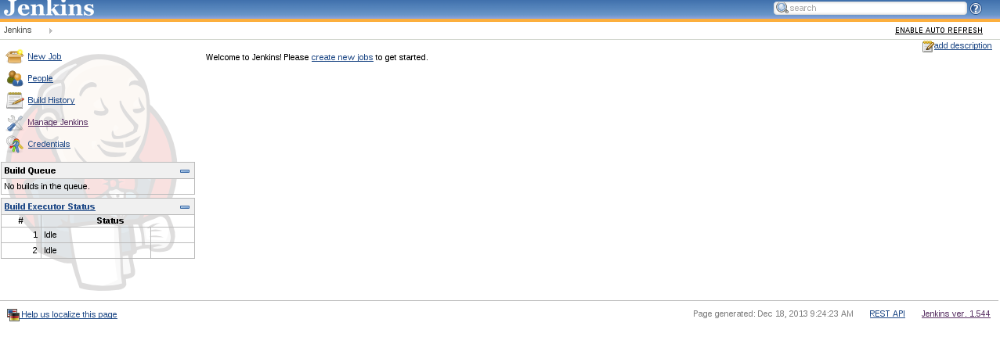

**************************
Software Environment Setup
**************************
This page explain how to install the following tools:

	* `Java Runtime Environment / Java Development Kit`_: *The Runtime environment is needed to run java applications while the Developer Kit is for compiling java applications.* 
	* `Apache Tomcat`_: *Servlet container where the application will run. A Servlet container is needed in order to process JSP pages and run Java Web Applications.*
	* `Apache Maven`_: *Is a software project management and comprehension tool, is used to run tests, compile, package  and deploy the application.*
	* `Jenkins`_:  *Continuous integration software used to automatize the task of test, compiling and package versions of the application and deploy.*
	* `Javasphinx`_: *Sphinx plugin that reads the javadoc in the source files and generate rst files.*
	* `GIT`_: Revision control tool
	* `Eclipse`_: *Integrated development environment (IDE).*
	
The tools will be divided in:

	* `Development Environment`_ (only for development onto the application and testing)
	* `Production Environment`_ (does not need the previous tools, with the sole exception of the JRE/JDK )

Development Environment
=======================

*Java Runtime Environment / Java Development Kit*
*************************************************
CentOs by default has a JRE (Java Runtime Environment) installed, but we recommend installing a JDK (Java Development Kit), mainly for
development purposes. In order to do so, follow the next steps:

#. Go to  `Oracle Java downloads  <http://www.oracle.com/technetwork/java/javase/downloads/index.html>`_
#. Select the JDK

	.. image:: images-java-env/image1.png

#. In the page *Java SE Development Kit 7 Downloads* select the latest JDK package according to your architecture and OS:
	* *jdk-7u51-linux-x64.rpm* for 64 bit Linux.
	* *jdk-7u51-linux-i586.rpm* for 32 bit Linux, or if you are unsure of your architecture.
#. After the file has been downloaded, open a console and write the following command:

	.. code-block:: bash

		$ rpm -Uvh jdk-7u45-linux-<i586|x64>.rpm

	.. image:: images-java-env/image3.png 
		:align: center
            
Verifying the JDK Installation
------------------------------
Execute in a command line:

.. code-block:: bash

	$ javac -version

*Eclipse*
*********
#. Download Eclipse from the `official site <http://www.eclipse.org/downloads/>`_
#. Unzip/Untar the file in a user folder (e.g. */home/user/*)

Verifying the Eclipse installation
----------------------------------
#. Go to the Eclipse installation folder (e.g. */home/user/eclipse*)
#. Execute the file called *eclipse* (with no extension)

*Git*
*****
#. Execute in the command line:

	.. code-block:: bash

		$ yum install git
  
	.. image:: images-java-env/image223.png 
		:width: 300px
		:align: center
		:height: 500px
      
Verifying the Git Installation
------------------------------
#. Execute in the command line

	.. code-block:: bash

		$ git --version

	.. image:: images-java-env/image224.png
		:align: center

*Javasphinx*
************
In order to install javasphix it is necessary to install sphinx 1.2 first 

Sphinx Installation
-------------------
#. Open a console and execute the following command:

	.. code-block:: bash

		$ easy_install -U Sphinx

Verifying the Sphinx Installation
%%%%%%%%%%%%%%%%%%%%%%%%%%%%%%%%%
#. In a command line execute:

	.. code-block:: bash

		$ sphinx-build

	and verify that the installed version is 1.2+

	.. image:: images-java-env/image119.png
		:align: center

Javasphinx Installation
-----------------------
#. Verify that the installed version of BeautifulSoup is not 4 through the Python interpreter with the following console commands:

	.. code-block:: bash

		$ python
		>>> import BeautifulSoup

	.. note:: if this throws an error it means that BeautifulSoup isn't currently installed.

	.. code-block:: bash

		>>> print BeautifulSoup.__version__

	.. note:: in order to exit the Python interpreter, just write:

		.. code-block:: bash

			>>> quit()
	
	If the version 4 is present, we must uninstall it:

	.. code-block:: bash

		$ easy_install -m BeautifulSoup4

#. Install BeautifulSoup 3.2.1 with the next command:

	.. code-block:: bash

		$ easy_install -U "BeautifulSoup==3.2.1"

#. After installing BeautifulSoup 3.2.1, execute the following command to install javasphinx:

	.. code-block:: bash

		$ easy_install -U "javasphinx==0.9.8"

	.. image:: images-java-env/image220.png
		:width: 300px
		:align: center
		:height: 500px

Verifying the Javasphinx Installation
%%%%%%%%%%%%%%%%%%%%%%%%%%%%%%%%%%%%%
#. Execute the following command:

	.. code-block:: bash

		$ javasphinx-apidoc

	.. image:: images-java-env/image221.png
		:align: center

Using Javasphinx
%%%%%%%%%%%%%%%%
#. In a command line write the following:

	.. code-block:: bash

		$ javasphinx-apidoc  -o <output path where the rst files will be written> <path to the .java files folder>

#. Execute the sphinx quickstart command:

	.. code-block:: bash

		$ sphinx-quickstart
		
	* You will be presented a few questions like project name, author and version.
	* Select that you want to separate the build folder from the source folder.
	* After specifying all the requested parameters, two folders will be available, the *build* and the *sources* folder.

#. Move all the files generated by the **javasphinx-apidoc** command to the *sources* folder, that was generated using **sphinx-quickstart**
#. Rename the file **packages.rst** to **index.rst** , or copy its contents into  **index.rst**
#. Edit the **sources/config.py** and in the extension list, add *'javasphinx'*

	.. image:: images-java-env/image222.png
		:width: 300px
		:align: center
		:height: 500px

#. Execute in the root folder (where the sources and build folders are):

	.. code-block:: bash

		$ make html

	.. note:: the HTML documentation will be in the *build* folder

Production Environment
======================
*Apache Tomcat*
***************
#. Download the binary files from the `Tomcat official site <http://tomcat.apache.org/download-70.cgi>`_.
#. Unzip the file wherever you want (we recommend doing it in **/var/lib/**, and that's what we'll assume from now on).

.. warning:: The Tomcat version must be 7

Configuration For Deploying With Maven
--------------------------------------
#.  Edit the file **conf/tomcat-users.xml** adding the following:

	
.. code-block:: xml
      
      	<tomcat-users>
      		<role rolename="manager-gui"/>
      		<role rolename="manager-script"/>
      		<role rolename="manager-jmx"/>
      		<role rolename="manager-status"/>
      		<role rolename="admin-gui"/>
      		<role rolename="admin-script"/>
      		<user username="admin" password="tomcat" roles="manager-gui,manager-script,manager-jmx,manager-status,admin-gui,admin-script"/>
      	</tomcat-users>
			
         		
Running Tomcat as a Service
---------------------------
#.  Go to **/etc/init.d** and create a file called tomcat (with no extension):
	.. code-block:: bash
 	
		 $ cd /etc/init.d

	.. code-block:: bash 
		
		$ vi tomcat

#. Copy the following and paste it inside the file:
		
	.. code-block:: bash 
				    			
		#!/bin/bash  
		# description: Tomcat Start Stop Restart  
		# processname: tomcat  
		# chkconfig: 234 20 80  
		JAVA_HOME=/usr/java/jdk1.7.0_45  
		export JAVA_HOME  PATH=$JAVA_HOME/bin:$PATH  
		export PATH  CATALINA_HOME=/var/lib/apache-tomcat-7.0.47  
		case $1 in  start)  
			sh $CATALINA_HOME/bin/startup.sh;;  stop)     
			sh $CATALINA_HOME/bin/shutdown.sh;; restart)  
			sh $CATALINA_HOME/bin/shutdown.sh  
			sh $CATALINA_HOME/bin/startup.sh;;  esac      
		exit 0  

#. Change the permissions to the tomcat file:
	.. code-block:: bash 

		$ chmod 755 tomcat

#. Execute:
	.. code-block:: bash 
	
		$ config --add tomcat
	
	.. code-block:: bash 

		$ chkconfig --level 234 tomcat on

#. Verify the execution:
	.. code-block:: bash

		 $ chkconfig --list tomcat

	.. image:: images-java-env/image5.png
#. Execute the following to start the service:
	.. code-block:: bash
	
		$ service tomcat start
   
.. note:: you may need to change file **/var/lib/apache-tomcat-7.0.47/bin/catalina.sh** permissions. For doing so, execute the following:
			
	.. code-block:: bash
		
		$ chmod 755 /var/lib/apache-tomcat-7.0.47/bin/catalina.sh
          
Verifying the Tomcat Installation
---------------------------------	
#. Open a browser and go to *http://localhost:8080*, if everything was correct you will see the following:

*Apache Maven*
**************
#. Download the binary files from the `Apache official site <http://maven.apache.org/download.cgi>`_.
#. Unzip the file wherever you want (we recommend doing it in **/usr/local**, and that's what we'll assume from now on).
#. Rename the recently created folder to **maven**.
#. Create the file **etc/profile.d/maven.sh**:
	.. code-block:: bash

		$ vi etc/profile.d/maven.sh

#.  Add the following:

	.. code-block:: bash
              
         export M2_HOME=/usr/local/maven
         export PATH=${M2_HOME}/bin:${PATH}
			
#. Save the file.

Test the Installation
---------------------
#.  Logout and login again.
#.  Execute in a command line:
	.. code-block:: bash
	
		$ mvn -version

Configure Maven to Deploy in Tomcat
-----------------------------------
#. Update the file **/usr/local/maven/conf/settings.xml** by adding the following:

.. code-block:: xml
     
      	<server>
      		<id>TomcatServer</id>
      		<username>admin</username>
      		<password>tomcat</password>
      	</server>

.. note:: the username and password must match the ones defined in **tomcat-users.xml** 

*Jenkins*
*********
#. Execute the following
	.. code-block:: bash

		$ sudo wget -O /etc/yum.repos.d/jenkins.repo http://pkg.jenkins-ci.org/redhat/jenkins.repo
		$ sudo rpm --import http://pkg.jenkins-ci.org/redhat/jenkins-ci.org.key
		$ yum install jenkins

Optional Configuration
----------------------
#. Edit the file **/etc/sysconfig/jenkins** changing the following values
	* **JENKINS_PORT="8080"** by **JENKINS_PORT="8081"**
	*	add **JENKINS_AJP_PORT="8012"**
	
.. note:: this way we avoid a port conflict if an instance of Tomcat (the default port is 8080) is running in the same server
				 
Verifying the Jenkins Installation
----------------------------------

#. Execute **service jenkins start**

#.  In a browser, go to *http:localhost:8081* and check that you can see the following:
	

Adding the Git Plugin
---------------------
#. To install plugins it is necessary to select the option **Manage Jenkins** available in the left menu:

	.. image:: images-java-env/image9.png

#. Select **Manage Plugins**:

	.. image:: images-java-env/image10.png

#. Select the **Available** tab:

	.. image:: images-java-env/image111.png

#. From the list select  **git plugin**.

JRE/JDK Configuration
---------------------

#. In the main page select **Manage Jenkins**:

	.. image:: images-java-env/image9.png

#.  Select the option **Configure System**:

	.. image:: images-java-env/image112.png

#. Now search for the option *JRE/JDK installation*:

	.. image:: images-java-env/image113.png

#. Uncheck the option Install Automatically:

	.. image:: images-java-env/image114.png
	.. image:: images-java-env/image115.png

#. In the option *JAVA_HOME* write the path to your local JRE/JDK installation. For example:
	* **/usr/java/jdk1.7.0_45**

	.. image:: images-java-env/image116.png

	.. note:: the path being used in this example corresponds to the installation path of the JDK described in previous sections,
		if the JDK was installed in another path, please put the one that corresponds to your installation

#. Save the changes.

Maven Configuration
-------------------

#. Repeat the steps 1 to 4 of the previous section (JDK configuration), changing the 3rd step for the Maven Option:
 
	.. image:: images-java-env/image117.png

#. In the *MAVEN_HOME* option, write:
   *	**/usr/local/maven**
		
	.. note:: the path being used in this example corresponds to the installation path of Maven described in previous sections,
		if Maven was installed in another path, please put the one that corresponds to your installation.

	.. image:: images-java-env/image118.png

#. Save the changes.
