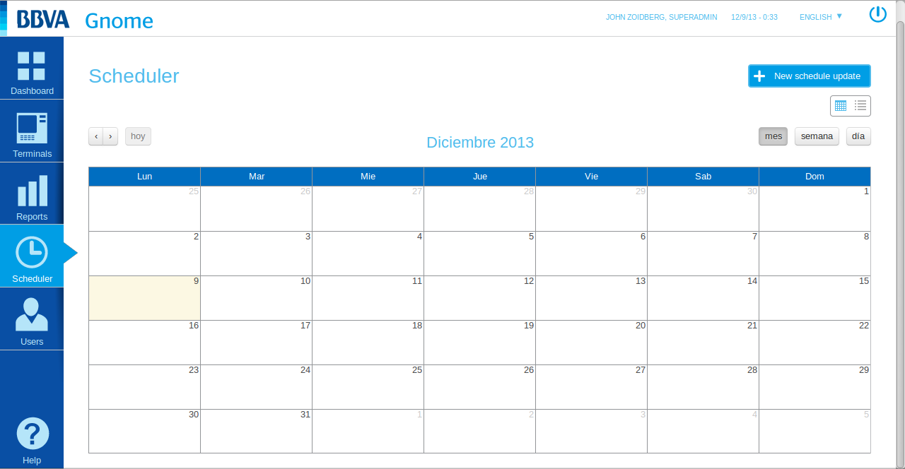
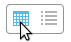
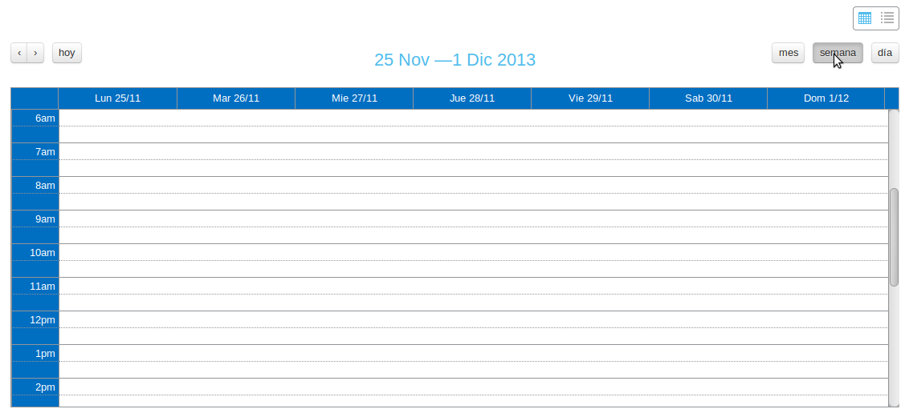

Scheduled Update Viewer
#######################

   Initial view of the update viewer. 

Here we can see the scheduled updates, either through the calendar view or a particular listing.

- *Calendar view*: We can check for updates scheduled throughout a month, week or day.

   Calendar view Selection.

With the buttons on the top left of the calendar we can navigate back and forth in time on the current view of the calendar.

.. figure:: resources/help/es/images/scheduler_viewer_calendar_month.png
   :width: 400pt

   Monthly calendar.

   Weekly calendar.

.. figure:: resources/help/es/images/scheduler_viewer_calendar_day.png
   :width: 400pt

   Daily calendar.
