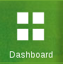

*********
Dashboard
*********

We can access Dashboard page through the link Scheduler the left menu.

	Link to *Dahsboard* in the left menu.

The dashboard is the main area  of the application, will be the first screen that you see, here is possible to see a summary of saved queries results, making  easier to see the information related to them.

.. figure:: ../resources/help/en/images/dashboard.png
	:align: center
	:width: 500px
        :height: 400px
	
	Dashboard Page

Each query can be associated to a widget, which is a small area where the information is displayed, the dashboard can have multiple  widgets and the way  they are presented can  be customized.

Change the Widget Layout
------------------------
The widgets are organized by columns and rows, by default  they are  organized by 4 widgets per row, this can be changed just by clicking the  layout option available in the top right.
Each option shows the number of widget per row that will be shown 

.. figure:: ../resources/help/en/images/widgets_layout.png
   :align: center
      
   Dashboard Layout
   
.. note:: The size of the widgets change when the layouts change,  less widgets per row means bigger widgets

Add new Widgets
---------------

To add a new widget, press the button labeled  *New Widget* located at the top left of the working area

.. figure:: ../resources/help/en/images/newWidget.png
   :align: center
      
   New Widget Button

After press the button, a new floating window will appear showing two available options, the first one allows to create a new widget from scratch, the  second allows to select one from the existing library

.. figure:: ../resources/help/en/images/newComponent.png
	:align: center
	:width: 300px
        :height: 400px
	
	Add new Component Window

.. note:: To close the floating window just click on the red x or anywhere outside the window

Create New Component
&&&&&&&&&&&&&&&&&&&&

In the window, add a name to distinguish the new widget in the name text box, select the chart type from the options displayed, select a saved query ( to know how to add a query go to the :doc:`Terminals <terminals>` section ), and select the type of measurement to apply in the chart, then press the button

	
	Add new Widget Window

The new widget now will be available in the dashboard

.. figure:: ../resources/help/en/images/addedWidget.png
	:align: center
	:width: 300px
        :height: 400px
 
Select One From The Existing Library
&&&&&&&&&&&&&&&&&&&&&&&&&&&&&&&&&&&&

Edit widgets
------------

To edit an existing widget, go to the right corner of the widget in order to make visible the edit option

.. figure:: ../resources/help/en/images/editWidget.png
   :align: center
      
   Edit Widget Option

Once selected the *Edit* option, the edit window will be visible, just change the desired values and press the button

.. note:: To delete a widget, select the option *Delete*, and the widget will be removed from the database

Close/Open widgets
------------------
To close an existing widget, go to the right corner of the widget in order to make visible the close option, is the one marked with an x

.. figure:: ../resources/help/en/images/closeWidget.png
   	:align: center
 	
	Close Widget

.. note:: Closing a Widget will not delete it from the database

To open a closed widget, just select *My Widgets* in the top left, and from the list select the one that you want to add again to the dashboard, after doing that, the widget will appear again in the dashboard.

.. figure:: ../resources/help/en/images/myWidgets.png
   	:align: center
	
	My Widgets
 
.. note:: All the closed widget will be in a diferent color in the list, and will show an arrow

