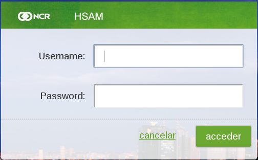

************
Login Logout
************

To access to all the functionalities of the system it is necessary to have a registered user, once the administrator of the application has created a valid user is possible to enter using the username and password.

Login
-----

When there is not a valid user session, the application will request to enter the username and password, in order to continue, write in the first text box a valid username, then the password and finally, press the *acceder* button.

   	
	Login Screen

.. note:: Is possible to clear the text boxes pressing the *cancel*  button

If the password does not match with the given username or the user is not registered in the application , will be possible to see a notification of *Bad Credentials*

.. figure:: ../resources/help/en/images/login_failed.png
	:width: 400px
	:align: center
	:height: 300px

   	Bad Credentials notification

 
Logout
------

To exit from the application, simply press the logout button located in the top right, once pressed, you will be redirected to the  login screen

.. figure:: ../resources/help/en/images/logut.png
	:align: center

	Logout Button

