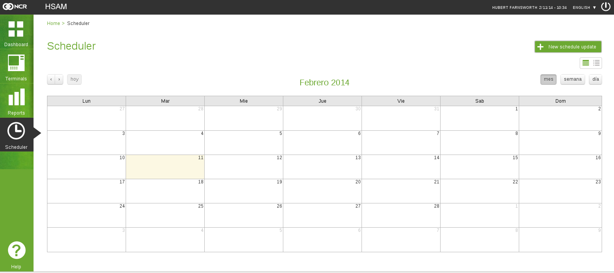

Scheduled Update Viewer
#######################

	Initial view of the update viewer. 

Here we can see the scheduled updates, either through the calendar view or a particular listing.

- *Calendar view*: We can check for updates scheduled throughout a month, week or day.

.. figure:: ../resources/help/en/images/scheduler_viewer_calendar_btn.png
	:width: 40pt
	:align: center

   	Calendar view Selection.

With the buttons on the top left of the calendar we can navigate back and forth in time on the current view of the calendar.

.. figure:: ../resources/help/en/images/scheduler_viewer_calendar_month.png
	:width: 400pt
	:align: center
	
	Monthly calendar.

.. figure:: ../resources/help/en/images/scheduler_viewer_calendar_week.png
	:width: 400pt
	:align: center

	Weekly calendar.

.. figure:: ../resources/help/en/images/scheduler_viewer_calendar_day.png
	:width: 400pt
	:align: center

	Daily calendar.

.. note:: The buttons indicate if the calendar is weekly, Daily or Monthly, the selected option will be darker and will be shown as pressed

.. note:: The actual day will be indicated in the calendar, will have a diferent background color
