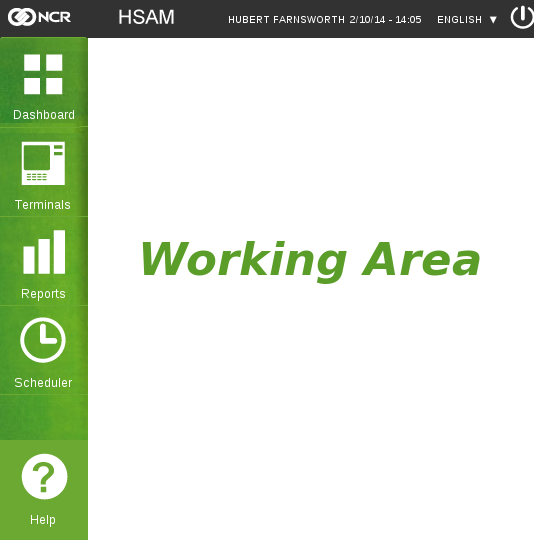
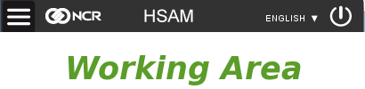

*************
User Manual
*************
In this section will be explained the different features and their options, first will be explained the basic navigation inside the application and then the operations allowed to each user
 

Navigation
===========
Once the user login will see this basic layout where the user can perform their operations 

	Application Layout

The user will have three basic operation areas, to the left will have the menu bar, where are offered the different available operations, including the help section located at the bottom of the menu bar. On top will have an option bar, where the user can select the language in which the application will show the messages, and log out. In the middle is the working area, where the different operations will appear.

Navigation Path
----------------

You can see always in which section you are, just by looking at the top left corner of the working area, there is shown the section or subsection where you are and the path you have follow.  The path is made using the following pattern: *Section > subsection1 > subsection2*. Each time you navigate to a subsection an arrow ( > )is added to the path. 

Sometimes, while performing an operation, you will be redirected to a subsection of the page, to return to the previous section click on the name of the desired subsection 

.. figure:: ../resources/help/en/images/navegationBack.png
	:align: center

	Navigation Path

In the image above, is shown that the user is in the *New Query* subsection ( it does not have a hyperlink), and to get there he has navigate through *Terminals* section  and then *My Queries* subsection. If the user wants to return to *Terminals* only have to click on the name and will be redirected to that section.

.. note:: Is strongly recommended to avoid the use of the back button of the browser and use the Navigation Path instead to return to a previous section.

Mobile Layout
-------------

The basic layout can change if the application is beeing used in a mobile device, or in a small display, because it has a responsive layout that adapts to the size of the window. 

	
	Application Mobile Layout

When this happen, the left menu will be hidden inside the button present in the left top corner, and the working area will be below the option bar

	
	Menu button

Once pressed the menu button, the options will appear as shown below and the white stripes of the button will change to green

.. figure:: ../resources/help/en/images/navegationMobileMenu.png
	:align: center
	:width: 200px
        :height: 250px
	
	Mobile Menu displayed

.. note:: The `Navigation Path`_ is also visible in the mobile layout, it will be visible on top of the working area

Menu Bar
--------

The menu bar offers to the user the different options available in the application.

.. figure:: ../resources/help/en/images/leftMenu.png
	:align: center
	:width: 50px
        :height: 200px
	
	Left Menu

To select one just press in the option, after doing so, the option will be selected ( will change the background  color) and will have an arrow pointing to the working area, also, the working area will change to show the data related to the operation.

	
	Option Selected

.. note:: If the displayed layout corresponds to the mobile layout, the mechanic will be the same

Language Selection
------------------

It is possible to change the language in which the application is shown, to do so, select the language option, located at the top right, in the option bar

	
	Language Option

After pressed, will be possible to see the different languages available, just click in the desired one and the application will show the labels and messages in the selected language

.. figure:: ../resources/help/en/images/languageSelection.png
	:align: center
	
	Language Selection

User Greeting
--------------

The user greeting section allow to know the current logged user, and the current time. This option is just informative and no operation can be done on it

	
	User Greeting

Operations
===========

The following operations are available through the menu bar ( Dashboard, Terminal, Reports, Scheduler and Users) and from the option bar (Logout). The visibility of this operations will depend on the role that the user have in the application.

.. toctree::
   :maxdepth: 2
   
   login-logout.rst
   dashboard.rst
   terminals.rst
   reports.rst
   scheduled_updates.rst
   users.rst
