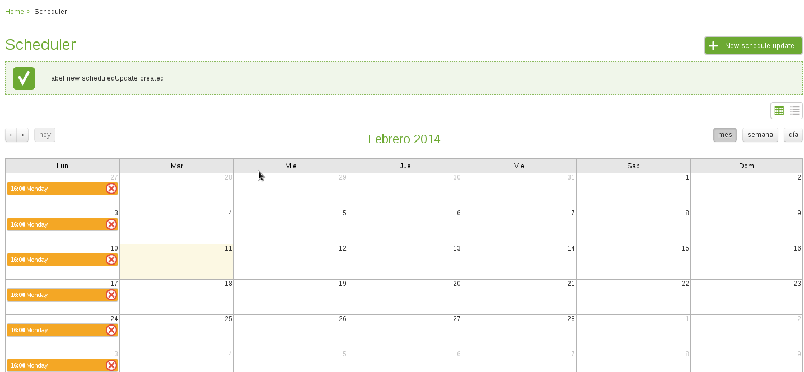

Add Scheduled Update
--------------------

To schedule a new update, press the *New Schedule Update* button located at the top right

      
   New Schedule Update

Once pressed you will be redirected to the *New schedule update* page, where a form will be presented in order to add the new schedule update.

First of all it is necessary to have created at least one query, to know how to add a new query go to the **Terminals** section , after selecting the desired query, proceed with assigning a distinguish name to this new schedule update, do the same with the description.

After the query, the name and the description is filled, select the repeat frequency, which can be:
	* **Monthly**: Means that this new update will be executed each month in the specified day and time. *E.g. Each 14th of the month  at 22:00*
		.. figure:: resources/help/en/images/scheduleUpdateMonthly.png
		   	:align: center
			:width: 400px
			:height: 500px	      
				   
			Adding a Monthly Schedule Update
		
	* **Weekly**: The new update will be executed in one day of the week.  *E.g. Each Monday at 21:00*
		.. figure:: resources/help/en/images/scheduleUpdateWeekly.png
		   	:align: center
			:width: 400px
			:height: 500px	      
				   
			Adding a weekly Schedule Update

The final step is to define the time in which this update will be executed, select the hours of the day (from 00 to 23), the minutes (from 00-59), and the timezone (using the Greenwich Mean TIme (GMT)), that will determine the time zone to be use as reference to the entered time. 

.. note::  To know the GMT to apply is possible to visit `<http://www.worldtimezone.com/>`_ or `<http://www.timeanddate.com/time/map/>`_

To finish press the *Add Task* button, then will be possible to see the scheduled update in the Scheduled Update Viewer

	
	Added Schedule update

.. note:: To delete a scheduled update, locate it on the Scheduled Update Viewer and press the red X visible on each scheduled update, if the operation is successful, will be removed from the Scheduled Update Viewer
