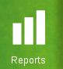
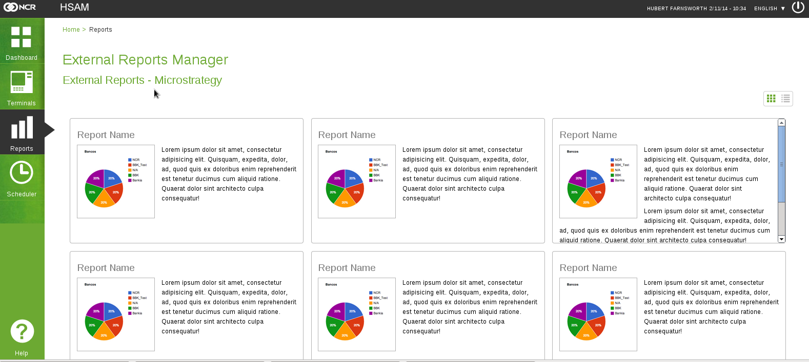

Reports
*******

We can access Report page through the link Scheduler the left menu.

	Link to *Reports* in the left menu.

The report area allows an user to see a pre generated report, to select a desired report, just click on it and you will be able to see in detail the report

	Reports Page

Change the Reports Layout
--------------------------
The reports summaries can be organized or by columns and rows or by list, by default  they are  organized by 3 reports summaries per row, this can be changed just by clicking the layout option available in the top right.

      
   Report Layout 

