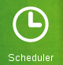

Scheduled Updates
*****************

We can access scheduled update page through the link *Scheduler* the left menu.

	Link to *Scheduler* in the left menu.

ATMMonitoring allows us to execute scheduled data updates from ATM, that is, the updates execute  periodically at a given time. In this way we ensure that the ATMs data  are kept updated as often as we deem necessary.

.. warning:: To schedule an update it is necessary to have at least one created query, to do so go to the **Terminals** section

.. include:: scheduled_updates_schedules_viewer.rst
.. include:: add_scheduled_update.rst
