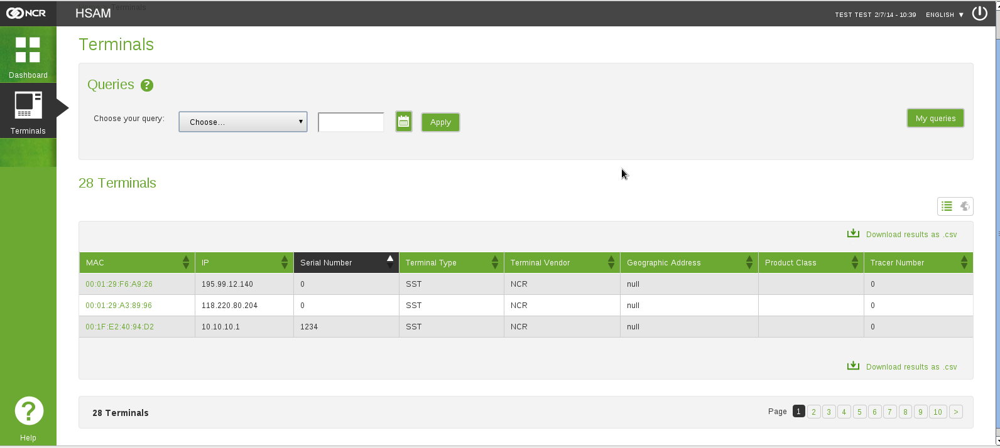
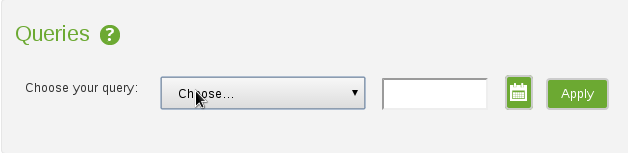
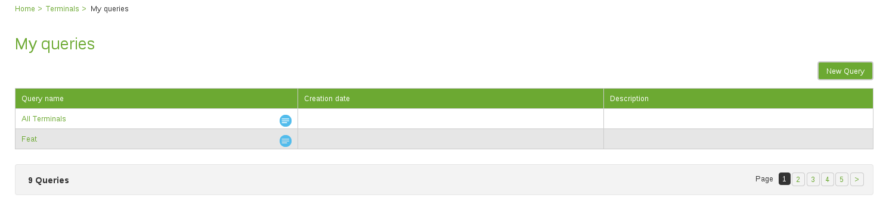
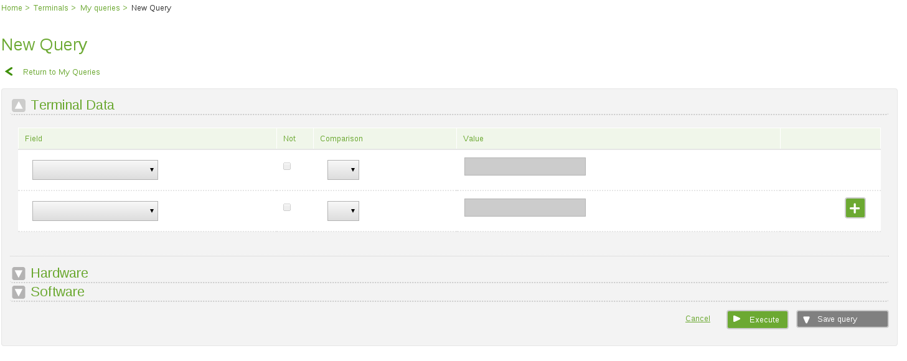
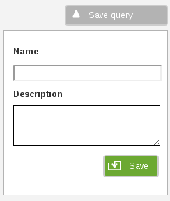
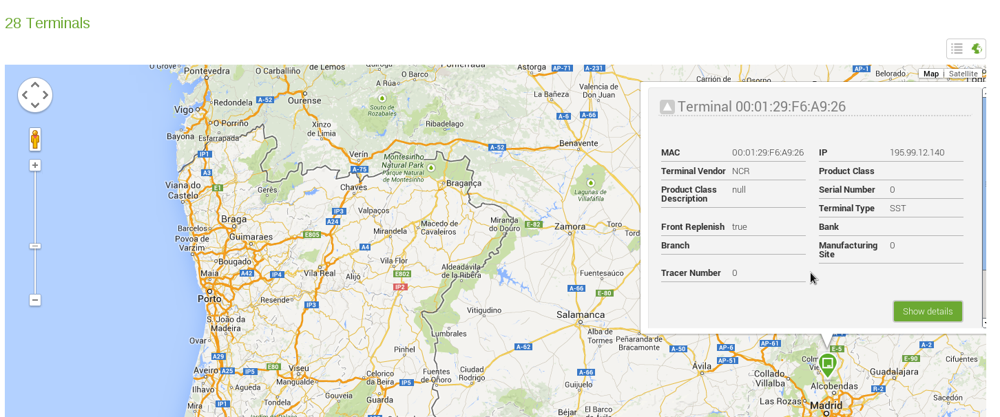

Terminals
*********

We can access Terminals page through the link Scheduler the left menu.

.. figure:: resources/help/en/images/terminalsLeftButton.png
	:align: center
	:width: 40pt

	Link to *Terminals* in the left menu.

In the Terminal section is possible to see the list of ATM (or terminals) that are a  result from a query, each user can create his own query and execute them in this area. 
From the list is possible to see the details of each ATM machine, export the list to a csv file or view in a map the location of each ATM Machine

         
         Terminal Section

Queries
-------
In this part of the page is possible to execute different queries and see the result in the list below. Each query brings a list of ATM Machines acording 
to restrictions added by the user.

Execute a Saved Query
&&&&&&&&&&&&&&&&&&&&&
To execute an existing query, just select from the list the desired query, then press the  *Apply* button. After doing this, the list will be updated.
Is possible to filter the results by adding a date for query to auditable elements, to do so, pick the desired date pressing the calendar button and then the *Apply* button

         Query Selection
         
.. note:: The title of the list will change after executing a query, from **Terminals** to **Terminals for the query : Name of the query**
.. note:: To execute the default query (will bring all the ATM) select the option *Choose..* from the list and then press *Apply*. the title of the list will say **Terminals**

My Queries
&&&&&&&&&&
In this section is possible to manage the existing queries, to access this section press the button **My Queries**

.. figure:: resources/help/en/images/myQueries.png
         :align: center

         My queries Button

After pressing the button you will be redirected to *My Queries* section, once there is possible to see all the existing queries, edit or create a new one

         
         My Queries Section

New Query
=========
To access to the Add Query section is necessary to press the button *New Query* located to the right

        New Query Button

Then will be possible to see the following: 

         
         Add Query Section

In order to create the query, is needed to add the criterias, grouped in three categories which are:

	* **Terminal Data**: Holds the criterias related to the ATM Machine such as IP, MAC Address, Bank, Terminal Model and Type, Serial Number, etc.
	* **Hardware**: Contains all the related to the hardware present in the ATM, such as Floppy Drive, Hard Drive, Memory, Ports, Network Adapter, Financial Device information, XFS and JXFS Component information, etc.
	* **Software**: Have all the criterias related to the software installed in the ATM, like Operating system, Internet Explorer, Hotfix, XFS Service Providers, etc.

.. note:: Is possible to open and close a category just by clicking in the title, the arrow next to it indicate if the category is open ( pointing up) or closed (pointing down).

Adding a Criteria
%%%%%%%%%%%%%%%%%

To add a criteria to a query, just select one from the list titled *Field*, then add a Comparison and finally a value to make the comparison

The available comparisons are:

	*  *Alphabetical After/before After/Before equals*: The result will be bring records that are after or before (or including) the reference value, taking into account the alphabetic order. E.g. *Alphabetical After B will bring the matching results  starting from C*
	*  *Contains* : The result will have matches that contains the given value
	*  *End/Start With*: The result will have matches that starts or end with given value
	*  *Equals*:The result will have matches that  are equals with given value
	*  *Is Null*: The result will have matches that  are empty or null in the database
	*  *Is True/False*: The result will have matches that  have values true or false

If the Not box is checked, will negate the comparison, for example if *Contains* is selected will be translated to *Do not contains*

To add more criterias, just press the plus button in the right

        
	Criterias

.. note::  To clear the criterias, just press the cancel button located in the bottom right

Executing a New Query
%%%%%%%%%%%%%%%%%%%%%
Once all criterias are selected, is possible to test the results, to do so, press the  execute button on the bottom right
 

        
	Execute new Query button

The result of the execution will be shown in a new page where will be possible to see the results of the query ( at the bottom),edit or add new criterias ( top) , execute again, delete the query or save it

        
	Execute Result Page

.. note:: To edit or add new criterias  follow the instruction from the section **Adding a Criteria** and to save follow the instructions from **Saving a New Query**

Saving a New Query
%%%%%%%%%%%%%%%%%%%%%

To save  the query, just press  the button labeled **Save Query**, once pressed, a small window will appear below the save button. In the small window write a name for this query ( this field is required)  and a description ( optional). Finally press *Save* in the small window

	Save Query Window

.. note:: The save option is available from the New Query section and the Execute new Query Section

Edit Existing Query
===================
In the section *My Queries* press on the name of the query that you want to edit, you will be redirected to a new page similar to the one shown in the section **Executing a New Query** labeled as Execute Result Page. To edit the selected criteria, follow the instructions given in the **Adding a Criteria** Section, once you have finish changing the criteria , you can execute the modified query (follow the instruction in **Executing a New Query**) or save the modifications (follow the instructions given in Saving a New Query, but leave  the field Name as it is)

List of ATMS
------------
In the Terminal page is shown the result of a given query, each query returns a list of match ATMs machines that are presented in a table. Is possible to navigate through the results using the numbers located below the table, or just go to the next group of result by pressing the *>* button located at the end of the numbers row 

	Navigate through results

.. figure:: resources/help/en/images/resultTable.png
	:align: center
  	:width: 600px
	
	Result Table

View ATM Details
&&&&&&&&&&&&&&&&

To see the details of an ATM, just click on it and you will be redirected to the detail page

.. figure:: resources/help/en/images/terminalDetails.png
	:align: center
  	:width: 600px
        :height: 300px	
	
	ATM Details

Export result as csv
&&&&&&&&&&&&&&&&&&&&

Is possible to export the result of a query to a comma separated values or CSV file, to do so, click on *Download results as .csv* visible on top and below the  result table

	
	Download Result as .csv

View Geografic Location
&&&&&&&&&&&&&&&&&&&&&&&

The system gives the option to see in a map the current location of the ATMs, to switch to this view, press the button located on the top right from the result table

	Switch to Map view

Once pressed the result table will disappear and will be replaced with a map where is possible to see the ATMs, as is shown bellow 

	Map View

.. note:: Each ATM is represented using this icon:
	
	.. image:: resources/help/en/images/simpleMarker.png

	clicking on it will display the details as is shown in the picture above.

	

