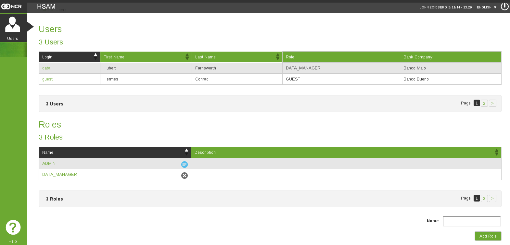
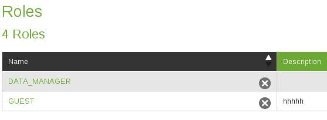

Users
*****

We can access Users  page through the link *Users* the left menu.

.. figure:: resources/help/en/images/usersLeftButton.png
	:width: 40pt
	:align: center

	Link to *Users* in the left menu.

The Users page is where is possible to manage the users and their roles inside the application

	Users Page

User Management
---------------
The user management section is located at the top of the working area

	User Management

In this section is possible to see a table where all the users registered in the application are shown. Here is possible to perform three operations:
  
See The Login Information
&&&&&&&&&&&&&&&&&&&&&&&&&

By clicking on the row where the user is, is possible to go to the login data page, where is shown the actual data linked to the user, from there is possible to perform the Edit operation, just click in the *Edit User* button located at the bottom right.

.. figure:: resources/help/en/images/loginData.png
	:align: center
	:width: 400px
	:height: 300px

	Login Data

Edit User Information
&&&&&&&&&&&&&&&&&&&&&
 In this section is possible to edit the user information, just select the desired field, change the value and press *Update User Data*

.. figure:: resources/help/en/images/updateUserData.png
	:align: center
	:width: 400px
	:height: 300px

	Update Login Data
	
Change the Role of the User
===========================
 To change the role, select the new role from the combo box in the window and press *Update User Data*

Role Management
---------------

Is located after **User Management** 

	Update Login Data

In the role management section is possible to perform 4 basic operations: **See Role Details**, **Edit Role**, **Add Role** and **Delete Role**

See Role Details
&&&&&&&&&&&&&&&&

To see the detail of a role, just click on the row and you will be redirected to the Role Detail page where is possible to see all the permissions assigned to this role.

.. figure:: resources/help/en/images/roleDetails.png
	:align: center
	:width: 400px
	:height: 300px

	Role Details

Edit Role
&&&&&&&&&
In this section is possible to edit the role information, just select the desired field, change the value and press *Update Role*

To access this feature, click on the button *Edit Role* located in the bottom right of  *Role Detail page*, after pressed the button, you will be redirected to the edit page.

In the Edit page you can do the following:
	* *Change role Name and/or description*: to change the name or the description of a role just write the new value in the text box
	* *Add or remove permissions*: To add a permission or remove it click on the check box to change the value, if the check box is *checked* means that the role has the permission, otherwise is not allow to execute the action

.. figure:: resources/help/en/images/roleEdit.png
	:align: center
	:width: 400px
	:height: 300px

	Role Edit

Permisisions
============

Each permission allow a user, link to the role, to have access to a specific section of the application, or to be allow to perform an action.  The following explain the meaning of each permisison:

	* **Can View Terminals**: Allow an user to access the `Terminals <terminals>` section and view the list of ATM
		* *Can Edit Terminals*: Allow the user to modify the ATM information.
		* *Can request Update*: Allow the user to be able to communicate with an ATM and request an update.
		* *Can Use Queries*: Allow the user to create and execute queries in order to fetch the ATM information.
	* **Can Schedule**: Specify if the user is allowed to enter the `Schedule Update <scheduled_updates>` section and schedule an update
	* **Can Access Reports**: Tells if the user can have access to the `Reports <reports>`

Add Role
&&&&&&&&

To add a new role, go to the bottom right of the working area, and write in the text box labeled *Name* the name of the new role, then press the *Add Role* button

.. figure:: resources/help/en/images/addRole.png
	:align: center

	Add Role

After that you will be redirected to the `See Role Details` follow the instructions there to move through the page, also if you want to assign permissions to the newly added role, follow the instructions given in  **Edit Role**

Delete Role
&&&&&&&&&&&

To delete a role, locate it in the table of `Role Management` and press the icon next to the name 

	Delete Role

.. note:: Is not possible to delete the *ADMIN* role

