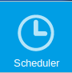

Actualizaciones programadas
---------------------------

ATMMonitoring nos permite ejecutar actualizaciones de los datos de los cajeros de manera programada, es decir, para que se ejecuten de manera periódica en un determinado momento. De esta manera nos aseguramos de que los datos de nuestro parque de cajeros se mantienen actualizados con la frecuencia que consideremos necesaria.

Podemos acceder a la página de actualizaciones programadas a través del enlace *Scheduler* del menú lateral.

   Entrada *Scheduler* en el menú lateral.

.. include:: scheduled_updates_schedules_viewer.rst
