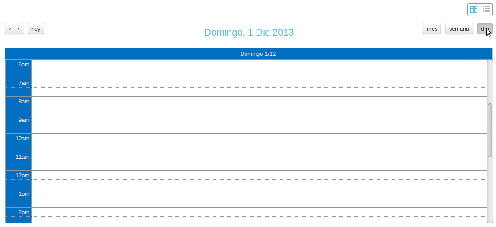

Visor de actualizaciones programadas
####################################

.. figure:: resources/help/es/images/scheduler_viewer.png
   :width: 450pt

   Vista inicial del visor de actualizaciones.

En esta página podemos comprobar las actualizaciones programadas, bien a través de la vista de calendario o de un listado concreto.

- *Vista calendario*: podemos comprobar las actualizaciones programadas a lo largo de un mes, semana o día.

.. figure:: resources/help/es/images/scheduler_viewer_calendar_btn.png
   :width: 40pt

   Selección de la vista en calendario.

Con los botones en la parte superior izquierda del calendario podemos navegar atrás y adelante temporalmente en la vista actual del calendario.

.. figure:: resources/help/es/images/scheduler_viewer_calendar_month.png
   :width: 400pt

   Calendario mensual.

.. figure:: resources/help/es/images/scheduler_viewer_calendar_week.png
   :width: 400pt

   Calendario semanal.

   Calendario diario.
